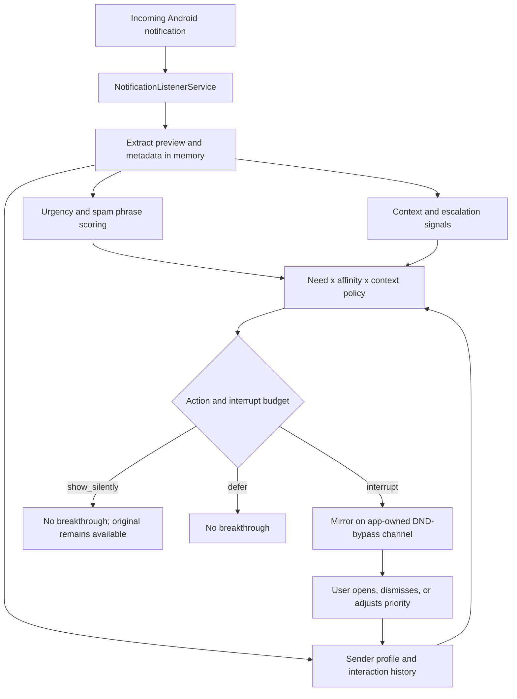

# AttentionAI: A Privacy-Preserving, Context-Aware Notification Triage System for Android

**Author:** [Author name]  
**Affiliation:** [Institution or organization]  
**Date:** September 2026

## Abstract

Mobile notifications compete for attention, while Do Not Disturb (DND) modes can also silence messages that users would consider urgent. This paper presents AttentionAI, an Android prototype that selectively mirrors high-priority notifications through a user-authorized DND-bypass channel. Its deterministic, on-device policy combines message-level urgency, sender affinity learned from interaction feedback, contextual penalties, and temporal escalation such as repeated messages or calls. It is not a trained machine-learning model: urgency is extracted using weighted phrase matching, a bounded negation window, promotional-language damping, and explicit critical-wording overrides. The implementation includes a Kotlin Android notification listener and policy engine, a Python reference engine, and a shared set of labeled scenarios that tests behavioral parity. In that hand-authored corpus, all 20 scenarios matched their expected three-way action (interrupt, show silently, or defer). Treating interruption as the positive class yields 10 true positives, 10 true negatives, zero false positives, and zero false negatives, corresponding to 100% precision, recall, and accuracy on this test set. Python tests (181) and Android unit tests also passed. These results establish implementation consistency on designed examples, not generalization to real notifications. Latency, battery impact, and user outcomes have not yet been measured. The prototype contributes a transparent, offline decision policy and Android implementation; evaluation on consented real-world data remains necessary.

**Keywords:** notification management, Do Not Disturb, mobile computing, attention, privacy, Android

## 1. Introduction

Smartphones deliver messages from personal, workplace, social, and automated sources through a shared notification surface. Because interruptions can disrupt ongoing work, users use quiet modes such as Do Not Disturb (DND). However, a mode that suppresses broadly may also hide an urgent request from a family member, an unknown caller, or a colleague. This creates a tension between protecting attention and remaining reachable for exceptional events.

Existing platform controls offer useful but largely preconfigured ways to manage this tension. Android DND policies can allow selected categories, contacts, starred senders, important conversations, and repeat callers [1]. Apple Focus similarly allows configured people and apps, and supported devices can enable Apple Intelligence's Intelligent Breakthrough & Silencing to allow important notifications [2, 3]. AttentionAI is therefore not the first system to prioritize notifications or use content. Its design question is narrower: can a user-auditable Android prototype combine message wording, sender history, interaction context, and repeated-contact signals locally, while offering one explicit breakthrough path?

AttentionAI addresses that question with a deterministic, on-device policy and a functioning Android notification-listener implementation. The system distinguishes `interrupt`, `show_silently`, and `defer`; it does not claim that every notification is semantically understood. Its central design choice is to multiply message need by sender affinity and situational context, while reserving overrides for critical phrases and repeated calls. This prevents high sender affinity alone from making routine small talk interruptive, yet lets selected emergency patterns bypass normal scoring.

This paper makes three contributions: (1) a formal, inspectable urgency and prioritization policy; (2) parallel Kotlin and Python implementations checked against one behavioral corpus; and (3) an initial reproducible evaluation with explicit limitations. It does not claim a trained model, a production-grade clinical or safety system, or field-validated accuracy.

## 2. Related Work

Research has documented the costs and context of digital interruptions. Mark, Gudith, and Klocke studied the cost of interrupted work, reporting a tradeoff between working faster after interruptions and increased stress [4]. Pielot, Church, and de Oliveira conducted an in-situ study of mobile phone notifications, providing empirical context for notification frequency and user response [5]. These studies motivate the problem but do not validate AttentionAI's policy or its performance.

Commercial operating systems provide user-configurable interruption filters. Android's `NotificationManager.Policy` exposes priority categories including alarms, calls, messages, conversations, and repeat callers, with sender filters such as contacts and starred contacts [1]. Apple Focus can allow or silence selected people and apps, and Apple's documentation describes Intelligent Breakthrough & Silencing on supported Apple Intelligence devices [2, 3]. These platform features overlap with AttentionAI's broad aim. The project's distinction is not a claim of superior intelligence; rather, it is its specific transparent combination of phrase-based message urgency, per-sender learned affinity, context, escalation, and local interrupt budgeting in an inspectable Android prototype. A direct comparative evaluation against platform features has not been performed.

Prior intelligent notification research makes clear that notification management is an established research area. Accordingly, novelty claims for AttentionAI should be limited to the particular policy, privacy-oriented implementation, and shared Python/Kotlin behavior contract unless a broader literature review establishes otherwise.

## 3. Methods

### 3.1 System Overview

AttentionAI's Android `NotificationListenerService` receives eligible posted notifications, extracts a preview and metadata, obtains local context and a sender profile, and sends an event to the Kotlin policy engine. An `interrupt` decision is mirrored as a separate AttentionAI notification on an app-owned channel configured to bypass DND. The mirror reuses the original notification's content intent when available. The original notification is not unsuppressed or modified. The user must grant notification access, notification-posting permission where required, and Android DND policy access; device settings and OEM behavior can still affect delivery.



The Python reference engine implements the policy independently. Both implementations consume the same JSON scenario corpus, which serves as a behavioral contract. This guards against divergence in the tested cases but does not prove equivalence for all possible inputs.

### 3.2 Urgency and Decision Policy

Let $u$ be the content urgency score, $e$ the escalation score, and $n$ the message need. Need combines urgency and escalation as a probabilistic OR:

$$
n = u + e(1-u)
$$

Need is increased to at least 0.85 for a missed call. A group message without a direct mention is multiplied by 0.40. Content urgency uses a hand-authored phrase-to-weight lexicon, including English, romanized Hindi/Hinglish, and selected Devanagari phrases. Multiword phrases are matched as contiguous token sequences. The highest matching phrase weight is used; urgency punctuation or shouting bonuses may be added, then promotional phrases reduce the score. Scores are clamped to the configured range. A negator within the four preceding tokens discounts the affected phrase to 25% of its configured weight. This is a compact heuristic, not general natural-language understanding.

Sender affinity $a$ is assembled from decayed relationship score, user-set tier, historical open rate, and starred-contact status. The weighted bond is transformed by a concave curve; affinity also receives a reunion term for senders with sufficient prior relationship history and long inactivity. Reunion credit is multiplied by need, so dormancy alone should not promote small talk. Context penalty $p$ accumulates configured penalties for meetings, calendar busy state, driving, night or sleep, and low battery, subject to a cap. The context factor is $c = 1 - 0.45p$ under the default configuration. The main priority score is:

$$
s = \operatorname{clamp}_{[0,1]}(n \times a \times c)
$$

The final score is raised to at least 0.85 for an un-negated configured critical phrase (for example, “help,” “emergency,” or “SOS”) or an escalation override for repeated calls. Critical vocabulary intentionally excludes ambiguous individual words such as “urgent,” “police,” “fire,” and “hospital.” Actions use thresholds of 0.70 for `interrupt` and 0.40 for `show_silently`; lower scores are `defer`. Muted senders are downgraded unless an override applies. An interrupt budget additionally limits ordinary breakthroughs to three per rolling hour, applies a ten-minute per-sender cooldown, and suppresses duplicates for five minutes; scores at or above 0.90 bypass rate limits (but not duplicate suppression).

The policy is deterministic, with no neural model, external inference service, or network request. The user's interactions can adjust relationship-profile features, but the engine does not train an urgency classifier from notification text.

### 3.3 Android Implementation and Privacy

The Android application is implemented in Kotlin, targets API 35, has minimum API 26, and uses Java 17. A `NotificationListenerService` processes notifications after the user grants notification access. The engine ignores ongoing and group-summary notifications and skips items that Android already allows through the active interruption filter. For decisions classified as interruptive, the app posts its own high-importance notification channel with `setBypassDnd(true)`. That bypass is conditional on user-granted DND policy access and channel/system settings; it is not a platform guarantee.

Notification text is processed in memory and is not written to the app's decision log. Sender identifiers are salted and hashed for persisted profiles; backup and device transfer are disabled for app data. Numeric interaction features are stored locally. These properties reduce exposure but do not eliminate it: the app requires broad notification access, and content is briefly present in process memory and in the breakthrough shown to the user. The Android privacy model therefore relies on local execution, limited retention, permissions, and user trust rather than a formal privacy proof.

### 3.4 Evaluation Design

The evaluation uses `shared/scenarios.json`, a fixed-time, hand-authored corpus of 20 scenarios with expected actions. Scenarios cover urgent and non-urgent content, negation, promotional wording, critical wording from an unknown sender, missed and repeated calls, sender dormancy, group mentions, a busy meeting, muted senders, non-conversational notifications, and Hinglish. Profiles, contexts, and escalation values are specified in each scenario to make results deterministic. The corpus was evaluated against the Python policy; unit tests also check exact expected actions, no missed interrupts, no false interrupts, and synchronization with Android's copy of the corpus.

For binary metrics, `interrupt` is the positive class and both `show_silently` and `defer` are the negative class. Metrics are computed from the 20 expected-versus-actual outcomes. Exact three-way action agreement is also reported. This is a software regression suite, not an independently sampled benchmark: labels are designed by the project author, sample size is small, and scenarios may reflect the policy's own assumptions.

## 4. Results

All 20 scenarios matched the expected action in the Python reference evaluation. Binary outcomes were 10 expected interrupts correctly classified as interrupts and 10 expected non-interrupts correctly classified as non-interrupts.

| Measure (interrupt is positive) | Result |
|---|---:|
| True positives | 10 |
| False positives | 0 |
| True negatives | 10 |
| False negatives | 0 |
| Precision | 100% (10/10) |
| Recall | 100% (10/10) |
| F1 score | 100% |
| Binary accuracy | 100% (20/20) |
| Three-way action agreement | 100% (20/20) |

These values describe only this designed corpus. In particular, zero observed errors in 20 examples must not be interpreted as a 100% real-world success rate or as evidence of a statistically precise population estimate.

The Python test suite completed with **181 passed**. Android Gradle unit tests completed successfully with **22 actionable tasks**, including tests that exercise the shared scenario behavior. These are correctness and parity checks, not end-to-end user tests on physical devices.

**Latency and resource results:** No per-notification latency benchmark, battery measurement, memory profile, or field telemetry was collected. Therefore, the project cannot substantiate a claim such as “under 150 ms,” quantify battery impact, or report a user-level reduction in interruption cost. The scoring path is deterministic and local, but speed and resource use remain empirical questions.

## 5. Discussion

The results show that the two implementations pass their current designed behavioral checks and that the policy handles several deliberately difficult distinctions: a close sender's routine message remains quiet; negated urgency is damped; promotional text reduces urgency; repeated calls can escalate; and critical wording can bypass low sender affinity. The multiplicative formulation makes content need necessary for ordinary breakthroughs, while explicit override paths preserve selected emergency behavior.

The system's central tradeoff is false interruption versus missed interruption. The corpus contains no observed error in either direction, but a hand-authored set cannot characterize this tradeoff in deployment. Critical-term overrides may be abused or triggered by a phrase used figuratively; negation detection can miss scope, sarcasm, or more complex constructions; phrase weights and translations have uneven coverage. Sender profiles can also be sparse, stale, or distorted by shared devices and changing relationships. Context signals may be inaccurate or unavailable, and a context penalty can suppress legitimate messages unless the override catches them.

The Android delivery path has platform-specific limitations. AttentionAI mirrors a qualifying notification rather than changing the source app's notification. DND bypass depends on permissions, channel configuration, and user settings; notification listeners and background execution can behave differently across manufacturers. A phone-level test matrix is needed before making claims about reliable audible delivery. The code uses a short wake lock during processing, but no battery study has established the incremental cost. Requiring notification access also has privacy implications even when content is not persisted or transmitted.

Finally, the current corpus evaluates policy decisions with a scenario-level expected action, not an independently annotated real message dataset. Its perfect score is useful as a regression indicator, but it is especially vulnerable to authoring bias and overlap between policy rules and test examples. The correct conclusion is “the prototype matches its 20 specified examples,” not “the system achieves 100% real-world accuracy.”

## 6. Conclusion and Future Work

AttentionAI is an Android prototype for local notification triage during DND. It combines deterministic phrase-based urgency extraction, sender affinity, context penalties, escalation patterns, explicit critical-wording overrides, and an interrupt budget. A Python reference implementation and Kotlin Android engine pass their existing test suites and agree with a shared 20-scenario behavioral corpus. This establishes a reproducible baseline for the implementation, not validated real-world effectiveness.

The next evaluation should recruit participants under an ethics-reviewed protocol, collect consented and minimized notification examples, and obtain independent urgency labels. The study should report precision, recall, F1, false-interrupt and missed-urgent rates with uncertainty intervals; stratify by language, sender familiarity, notification source, and context; and separate tuning data from held-out test data. A physical-device study should measure end-to-end notification latency, DND-bypass success, battery use, and interruption outcomes across Android versions and manufacturers. Future implementation work may explore richer multilingual semantics, user-adjustable explanations and thresholds, stronger local data protection, and an opt-in encrypted research pipeline. Any model-based extension should be compared against the present transparent baseline and must not be described as private or accurate without evidence.

## 7. Reproducibility and Target Venues

From the repository root, the software checks used for this paper can be repeated with:

```powershell
python -m pytest -q
python -m attentionai eval -v
.\android\gradlew.bat -p .\android testDebugUnitTest
```

The scenario corpus is `shared/scenarios.json`; the Android unit-test copy is checked for synchronization by Python tests. The codebase uses no inference dependencies for the urgency policy. Environment-specific results may vary for Android builds, and hardware-dependent latency and battery results are not covered by these commands.

Potential destinations depend on the eventual contribution. **ACM UbiComp/IMWUT** could fit a mature pervasive-computing contribution, but would normally require stronger user-centered evaluation and a clear research advance beyond an implementation. **IEEE Pervasive Computing** may be relevant for a practitioner-oriented account of ubiquitous-computing design, subject to its current submission criteria. **Journal of Open Source Software (JOSS)** is worth considering only if the software is packaged as a reusable research tool and meets its software-review requirements; an Android app alone may not be a fit. These are suggestions, not claims of acceptance or confirmed calls for papers. Check each venue's current scope, article type, and deadlines before submission.

## References

[1] Android Developers, “NotificationManager.Policy,” Android API Reference. https://developer.android.com/reference/android/app/NotificationManager.Policy (accessed September 28, 2026).

[2] Apple, “Set up a Focus on iPhone,” iPhone User Guide. https://support.apple.com/guide/iphone/set-up-a-focus-iphd6288a67f/ios (accessed September 28, 2026).

[3] Apple, “How to turn Do Not Disturb off or on for iPhone or iPad,” Apple Support. https://support.apple.com/en-us/105112 (accessed September 28, 2026).

[4] G. Mark, D. Gudith, and U. Klocke, “The cost of interrupted work: more speed and stress,” in *Proceedings of the SIGCHI Conference on Human Factors in Computing Systems (CHI '08)*, 2008, pp. 107–110. https://doi.org/10.1145/1357054.1357072.

[5] M. Pielot, K. Church, and R. de Oliveira, “An in-situ study of mobile phone notifications,” in *Proceedings of the 16th International Conference on Human-Computer Interaction with Mobile Devices and Services (MobileHCI '14)*, 2014, pp. 233–242. https://doi.org/10.1145/2628363.2628364.
